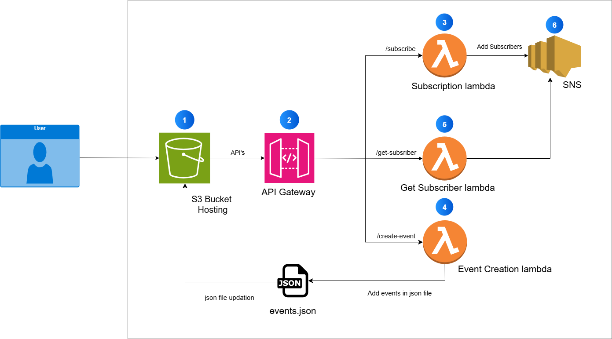

# Event Announcement System

A serverless web application for creating events and notifying subscribers via email using **AWS Lambda, S3, SNS, and API Gateway**.

---

## **Architecture Diagram**

---

## **Features**
- **Event Creation:** Users can create events (title, date, description).
- **Email Notifications:** All subscribers receive email notifications via **Amazon SNS**.
- **Email Subscription:** Users can subscribe via a simple web form.
- **View Subscribers:** Admin can fetch current subscribers.
- **Serverless Architecture:** Fully powered by AWS.

---

## **Lambda Functions**
| **Purpose**        | **File Name**             | **Handler**                         |
|--------------------|---------------------------|--------------------------------------|
| Event Creation     | `event_handler.py`        | `event_handler.lambda_handler`       |
| Subscription       | `subscription_handler.py` | `subscription_handler.lambda_handler`|
| Get Subscribers    | `get_subscribers.py`      | `get_subscribers.lambda_handler`     |

---

## **IAM Permissions**
To enable Lambda functions to access S3 and SNS, attach the following IAM policies to their execution roles:

### **1. For event_handler.py**
- **AmazonS3FullAccess** (read/write `events.json`)
- **AmazonSNSFullAccess** (publish notifications)

### **2. For subscription_handler.py**
- **AmazonSNSFullAccess** (subscribe emails)

### **3. For get_subscribers.py**
- **AmazonSNSReadOnlyAccess** (list subscribers)

---

## **Setup Instructions**

### **Frontend (S3)**
1. Upload `index.html` and `events.json` to an S3 bucket.
2. Enable static website hosting.
3. Update `API_BASE` in `index.html` with your API Gateway URL.

### **SNS**
1. Create an SNS Topic (e.g., `event-notifications`).
2. Add email subscriptions and confirm them.

### **Lambda**
1. Create three Lambda functions using code in `backend/`.
2. Set **Handler** as per the table above.
3. Attach IAM policies (see IAM Permissions section).

### **API Gateway**
1. Create a REST API with endpoints:
   - **POST /create-event** → eventHandler Lambda
   - **POST /subscribe** → subscriptionHandler Lambda
   - **GET /get-subscribers** → getSubscribers Lambda
2. Enable **CORS** for all routes.
3. Deploy the API and note the **Invoke URL**.

---

## **Testing**
1. Open your S3-hosted frontend.
2. Add a new event → Check email notifications.
3. Subscribe using your email → Confirm subscription.
4. Use "View Subscribers" to see all emails.

---

## **License**
This project is for demo and educational purposes.
